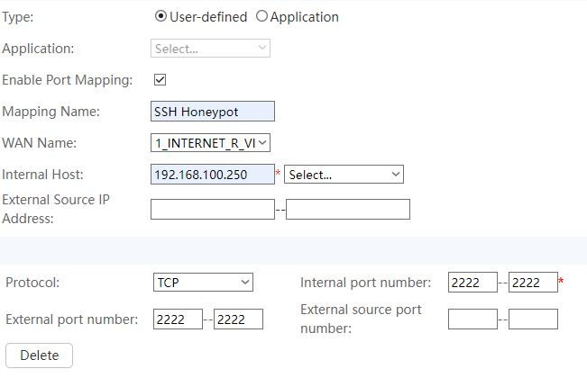

# Cowrie SSH Honeypot

This is a user-friendly guide to set up a Cowrie SSH honeypot on a Web server. Cowrie is a medium interaction SSH and Telnet honeypot designed to log brute force attacks and the shell interaction performed by the attacker. This guide will walk you through the installation and configuration of Cowrie on a Web server.

## Prerequisites

Before you begin, you will need the following:

- A Web server running a Debian-based Linux distribution (For my case, I am running the server locallly, on a Virtual Machine)
- A non-root user with sudo privileges
- Python
- Git

## Step 1: Install Cowrie

### Step 1.1: Prepare the virtual environment

Before you install Cowrie, you need to install some dependencies. Run the following command to install the required dependencies:

```bash
sudo apt update && sudo apt upgrade -y
sudo apt install python3-pip python3-dev libssl-dev libffi-dev build-essential virtualenv -y
```

### Step 1.2: Clone the Cowrie Repository

Next, you will need to clone the Cowrie repository. Run the following command to clone the Cowrie repository:

```bash
git clone https://github.com/cowrie/cowrie.git
```

This will clone the Cowrie repository to your server. Next, navigate to the Cowrie directory:

```bash
cd cowrie
```

Now, you will need to install Cowrie. To do this, it is recommended to use a virtual environment. Run the following command to create a virtual environment:

```bash
virtualenv -p python3 cowrie-env
```

This will create a virtual environment named `cowrie-env`. Next, activate the virtual environment:

```bash
source cowrie-env/bin/activate
```

Finally, install the required dependencies:

```bash
pip install -r requirements.txt
```

### Step 1.3: Configure Cowrie

Now that you have installed Cowrie, you will need to configure it. To do this, you will need to copy the `cowrie.cfg.dist` file to `cowrie.cfg`. Run the following command to copy the `cowrie.cfg.dist` file to `cowrie.cfg`:

```bash
cp cowrie.cfg.dist cowrie.cfg
```

Next, open the `cowrie.cfg` file in a text editor:

```bash
nano cowrie.cfg
```

In the `cowrie.cfg` file, you can configure various settings such as the SSH port, the log file location, and the log file format.
For this guide, we will only change the SSH port so that Cowrie listens on port 2222 and the logging.

```bash
sshPort = 2222
enable_logging = true
```

Hit `Ctrl + O` `Enter` to save the file and `Ctrl + X` to exit the text editor.

### Step 1.4: Start Cowrie

Now that you have configured Cowrie, you can start it.

```bash
bin/cowrie start
```

Cowrie will now start and listen on port 2222. You can verify that Cowrie is running by running the following command:

```bash
bin/cowrie status
```

## Step 2: Run the server and test Cowrie (If you are running the server locally)

For my case, I am running the server locally on a Virtual Machine. To run the server, I decided to do it the brutal way, by setting a static IP address and running the server on the host machine.

### Step 2.1: Set a static IP address

To set a static IP adress  we need to edit the netplan configuration file or the interface file. In my case, I will edit the interface one, knowing that my virtual machine does not work with netplan.
Notice that your virtual machine **must** be running in **bridge mode** so you can access it from it's IP address : Bride mode is a network configuration that allows the network bridge to connect to the physical network and the virtual network at the same time.

```bash
sudo nano /etc/network/interfaces
```

Add the following lines to the file:

```bash
auto eth0
iface eth0 inet static
    address 192.168.100.250
    netmask 255.255.255.0
    gateway 192.168.100.1
    dns-nameservers 8.8.8.8 8.8.4.4
```

- `address` is the static IP address you want to assign to the server.
- `netmask` is the subnet mask of the network.
- `gateway` is the IP address of the gateway.
- `dns-nameservers` are the IP addresses of the DNS servers (8.8.8.8 and 8.8.4.4 are Google's public DNS servers).

Hit `Ctrl + O` `Enter` to save the file and `Ctrl + X` to exit the text editor.

Apply the changes by running the following command:

```bash
sudo systemctl restart networking
```

You will probably need to restart the virtual machine to apply the changes.

### Step 2.2: Forward the port

A port forward is a way of making a computer on your home or business network accessible to computers on the internet, even though they are behind a router. It is commonly used in gaming, security camera setup, voice over IP, and downloading files.
To do so, you need to access your router's configuration page and forward the port 2222 to the server's IP address.

1. Open your browser and enter your router's IP address in the address bar. The default IP address is usually `192.168.100.1`.
2. Enter your username and password to log in to the router.
3. Navigate to the port forwarding section of the router. This is usually located under the advanced settings or the security settings.
4. Add a new port forwarding rule. Enter the following information:
    - Service Name: SSH Honeypot
    - Internal IP Address: `192.168.100.250`
    - Internal Port: `2222`
    - External Port: `2222`
    - Protocol: TCP

It should look like this:



To test if the port is open, you can use an online tool like [CanYouSeeMe](https://canyouseeme.org/). Enter the port number `2222` and click on `Check Port`. If the port is open, you should see a message saying `Success`.

## Step 3: Test Cowrie

Now that you have set up the server and forwarded the port, you can test Cowrie by connecting to it using an SSH client. Open an SSH client and connect to the server using the following command:

```bash
ssh root@<server_ip> -p 2222
```

Replace `<server_ip>` with the IP address of the server. You should see the Cowrie banner and be able to log in to the server. You can try running some commands to see how Cowrie logs the shell interaction.

To view the logs, you can navigate to the `log` directory in the Cowrie directory:

```bash
cd var/log/cowrie
cat cowrie.log
```

You should see the logs of the shell interaction performed by the attacker.

## Step 4: Redirecting the port (Optional)

If you want to redirect the port 22 to the Cowrie honeypot, you can do so by changing the SSH port in the `sshd_config` file.

To change the Cowrie's SSH port to 22, you will need to add this rule to the `iptables`:

```bash
sudo iptables -t nat -A PREROUTING -p tcp --dport 22 -j REDIRECT --to-port 2222
```

This rule will redirect all incoming traffic on port 22 to port 2222.

You will also need to modify the external port in the port forwarding rule on your router. Change the external port to `22`.

Now you can connect to the Cowrie honeypot using the default SSH port:

```bash
ssh root@<server_ip>
```

## Conclusion

In this guide, you have learned how to set up a Cowrie SSH honeypot on a Web server. Cowrie is a medium interaction SSH and Telnet honeypot designed to log brute force attacks and the shell interaction performed by the attacker. By following this guide, you can set up a Cowrie honeypot on your server and monitor the shell interaction performed by attackers.

## References

- [Cowrie GitHub Repository](https://github.com/cowrie/cowrie)

## Author

This guide was written by [Cherif Jebali](https://github.com/cowrie/cowrie)
To contact me, you can send me an email at [cherifjebali0301@gmail.com](mailto:cherifjebali0301@gmail.com)
